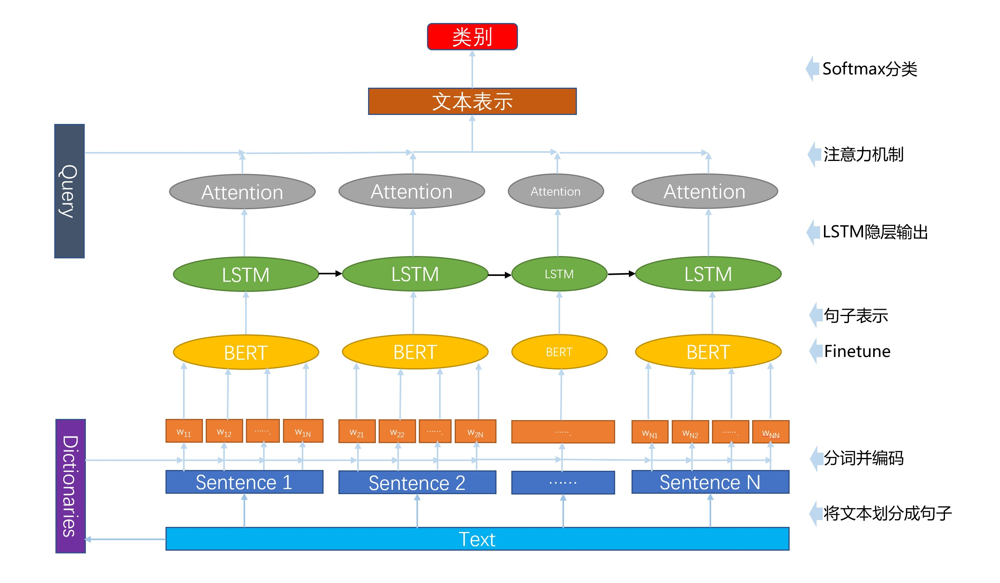
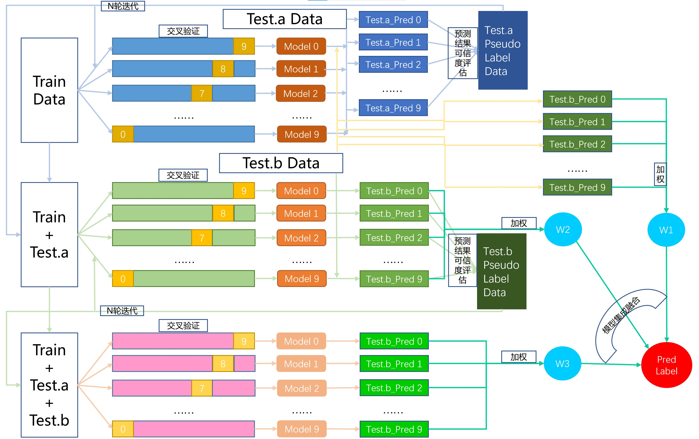

# 自然语言处理-新闻文本分类
## 天池-Datawhale 零基础入门NLP-新闻文本分类

* [比赛链接](https://tianchi.aliyun.com/competition/entrance/531810/introduction)
* 正式赛成绩：0.9659 (Rank 11/2589)。最终榜：Top10
---
## 运行方法
1. 将原始数据拷贝到./data/，可在天池比赛对应链接中下载
2. 运行 python ./src/main.py即可
* 注：因进行多轮训练，消耗资源较大。如果只为学习，可较少数据量和训练折数
* 如有疑问可联系：northbluem@qq.com

- **如果有帮助，还请点个star，感谢！！！**

---
## 文件夹结构
```
|-- README.md           # 介绍代码框架及解题思路
|-- img                 # 展示所用图片
|-- data                # 原始数据文件夹
|-- user_data           # 中间生成数据文件夹
|-- model               # 训练完成模型
    |-- emb             # 预训练的BERT模型
|-- prediction_result   # 预测结果输出文件夹
    |-- predictions.csv # B测试集结果文件
|-- src                 # 源代码
    |-- data_loader.py  # 数据加载器
    |-- dictionaries.py # 构建字典
    |-- ensemble.py     # 各模型集成
    |-- globalvar.py    # 全局变量管理器
    |-- label_test.py   # 伪标签标注
    |-- main.py         # 全流程代码入口
    |-- module_model.py # 模块模型
    |-- optimizer.py    # 优化器
    |-- train_flow.py   # 一次训练全流程
    |-- trainer.py      # 训练器代码
```

---
## 解题思路

### 模型框架
1. 建立字典；
2. 将文档，按照定长、定个数，划分句子；
3. 基于空格分词，并借助字典重新编码；
4. 利用BERT表示每个句子，即finetune时，将最后一层的第一个token [CLS]的隐藏向量作为输出；
5. 利用LSTM + Attention表示每篇文章；
6. 利用Softmax层实现分类。



* 注：由于计算资源限制，直接用了开源的预训练模型。此预训练模型为BERT-mini，且预训练时去除了NSP任务，只执行掩码语言模型。

### 训练预测架构
* 考虑到此任务预测正确率较高，且 teat_a 和 test_b 也含大量的数据，所以采用伪标签的半监督学习扩增学习数据。
1. 如果交叉验证的N个模型均预测出相同的结果，那么认为这个预测是可信的。为此条数据打上伪标签，在下一轮中参与训练；
2. 对 test_a 与 test_b 分别进行两次半监督的训练；
3. 因没有伪标签测试数据的训练的模型，正确率也很高。所以模型融合时，考虑不加伪标签测试数据、加test_a伪标签数据、加test_a和test_b伪标签数据这三批训练完成的模型。
4. 模型集成融合时，采用投票的方法，但根据参与训练的数据量加权每个模型的预测结果。

* 注：受计算资源限制，每次半监督训练只进行一轮；另受时间限制，test_a上半监督为十折交叉验证，test_b上半监督只训练十折中的随机四折。



---
* 声明：本代码参考了“Datawhale零基础入门NLP”开源学习资料，但采用了新的训练预测框架，并做了大量重构、优化了模型参数。
* [Datawhale-NewsTextClassification仓库](https://github.com/datawhalechina/team-learning-nlp/tree/master/NewsTextClassification)
